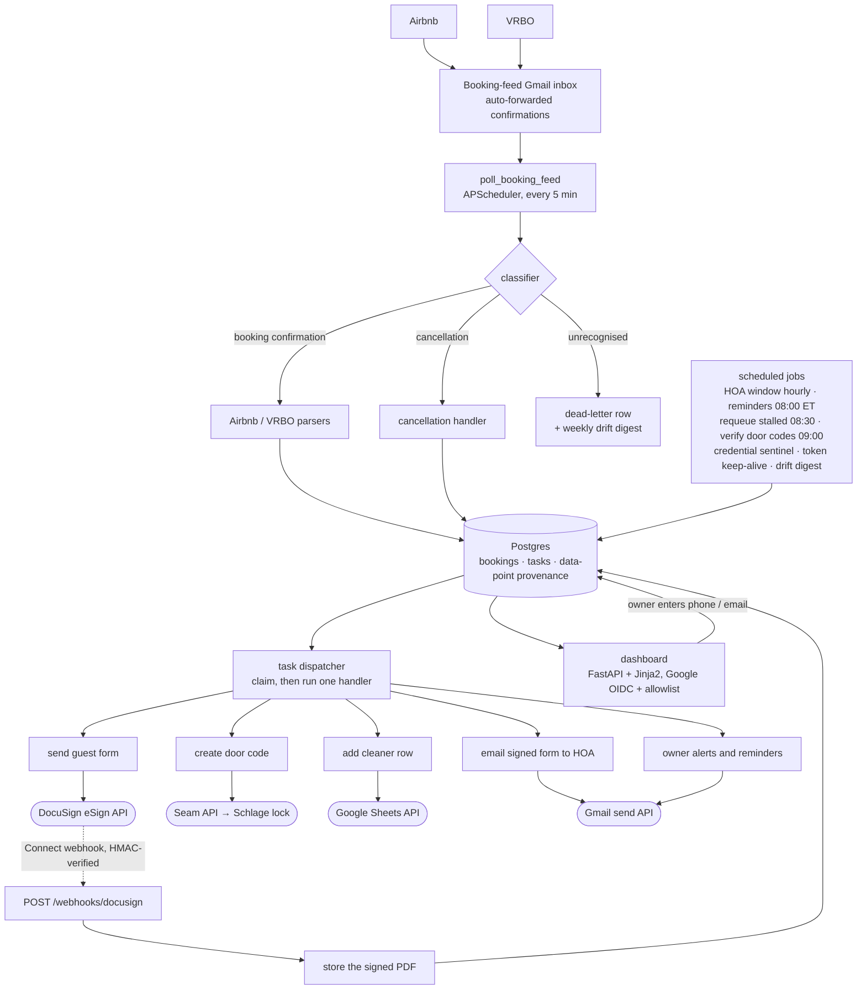
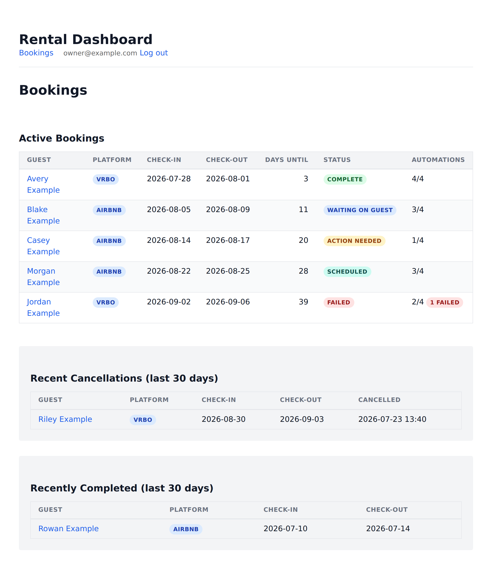
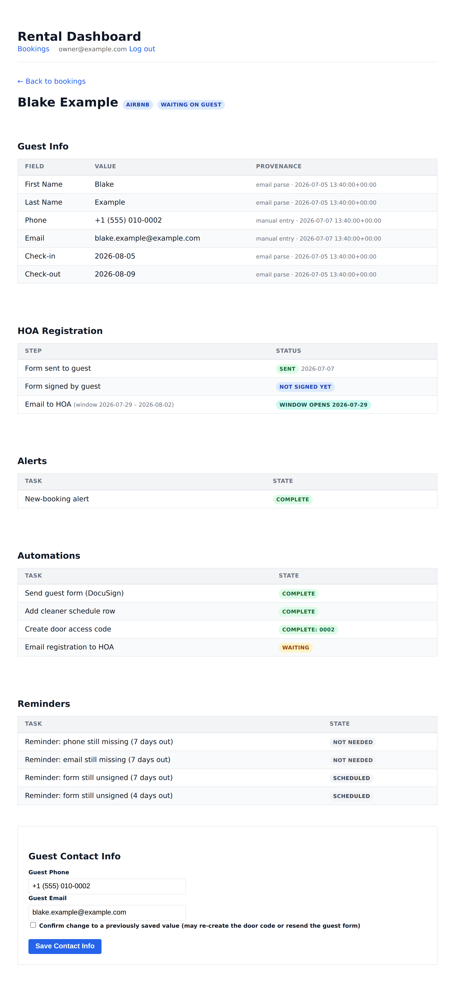
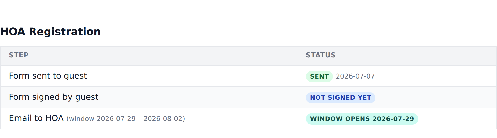

# Home Rental Automation

A self-hosted Python service that covers everything between a booking being
confirmed and the guest walking in the door, for a short-term rental listed on
Airbnb and VRBO.

A confirmation email lands in a dedicated inbox. The service parses it, creates
the booking, and opens a checklist of tasks against it: send the guest a
DocuSign registration form, program a time-bound code on the smart lock, add a
row to the cleaners' schedule, email the signed form to the HOA inside a narrow
date window, and chase the owner for the fields the listing platforms leave out
of their confirmation emails. It then works that checklist without supervision.

It has been running in production since 2026-07-21, against real bookings on a
live listing. One VPS, one Docker Compose stack.

---

## Contents

- [What it does](#what-it-does)
- [Architecture](#architecture)
- [The dashboard](#the-dashboard)
- [Domain rules](#domain-rules)
- [Tech stack](#tech-stack)
- [Testing](#testing)
- [Deployment](#deployment)
- [How it was built](#how-it-was-built)
- [Quick start](#quick-start)
- [Repository map](#repository-map)

---

## What it does

The automation covers booking confirmation through guest check-in. Anything
after check-in is handled by hand, which is where a person is more use than a
scheduler.

| # | Task | Trigger | Integration |
|---|---|---|---|
| 1 | Detect and parse the booking | confirmation email lands in the feed inbox | Gmail API |
| 2 | Alert the owner, with a deep link to the fields only they can supply | immediately | Gmail API |
| 3 | Add a row to the cleaners' schedule, in chronological position | immediately | Google Sheets API |
| 4 | Send the guest the HOA registration form | as soon as a guest email exists | DocuSign eSign API |
| 5 | Program a door code, valid 4:00 PM check-in day to 11:00 AM checkout day | as soon as a guest phone exists | Seam API, then the Schlage lock |
| 6 | Email the signed form to the HOA | inside the HOA's send window | Gmail API |
| 7 | Chase unfilled fields and unsigned forms at 7 and 4 days out | scheduled | Gmail API |
| 8 | On cancellation: void the envelope, delete the door code, alert for the rest | cancellation email | DocuSign + Seam |

Each line above is a row in a `booking_tasks` table with its own state machine
(`pending → waiting → in_progress → complete / failed / skipped`). At any point
there is a stored answer to what has run, what is blocked, and why.

## Architecture

A single FastAPI process runs the web app, the webhook receiver and an
APScheduler instance. Postgres stores the bookings, the tasks and the
provenance records.



A few things the diagram flattens.

An email that looks like a booking but fails to parse becomes a dead-letter row
and an owner alert. Anything that doesn't look like a booking is dead-lettered
quietly, though platform-domain senders still turn up in a weekly review
digest. That digest exists because a platform quietly changing its email format
would otherwise take months to notice.

Handlers claim a task before running it. The row moves to `in_progress` under a
lock, so a dashboard action and a scheduler tick can't both send the same
envelope or write the same spreadsheet row twice.

Guest name, phone, email and the dates each carry a provenance record: email
parse, manual entry, DocuSign webhook, Seam. When the system's picture of a
booking looks wrong, the dashboard shows where each value came from.

## The dashboard

Read-mostly, behind per-user Google sign-in with an email allowlist that gets
re-checked on every request. There is one write path, the contact form, because
guest phone numbers and email addresses have to be typed in by hand.



The status column is derived at render time and answers who the booking is
waiting on. `action needed` is the owner, `waiting on guest` is a signature,
`scheduled` is a date window, `failed` wants attention now.



All data in these screenshots is fabricated: placeholder names, 555 phone
numbers, example.com addresses.

## Domain rules

The integrations took less work than the rules they have to satisfy.

### The HOA send window

The signed form may go to the HOA no earlier than 7 days before check-in, and
no later than the last day that still leaves two full HOA-open days between the
send day and check-in. The HOA is closed on Sundays. The send day itself
doesn't count towards the lead time and can fall on a closed day. A Sunday
check-in therefore has a Thursday deadline.

All of that arithmetic runs on the US/Eastern calendar date. The production
container runs UTC, where it is already tomorrow from 8 PM Eastern, so a
comparison against the server clock is wrong every evening.



A signature arriving after the deadline still triggers a send, with a warning
logged, since the HOA can usually expedite a late packet if someone calls them.
The later bound is the last acceptable day for a scheduled send rather than a
condition on sending at all.

### Door codes

Valid from 4:00 PM on the check-in day to 11:00 AM on the checkout day, US
Eastern, stored in UTC and converted at the Seam boundary. Seam programs the
hardware asynchronously, so a successful API call doesn't mean the code is on
the lock yet. A daily job re-reads the device to confirm.

### The cleaners' spreadsheet

Rows sit in ascending check-in order, and new ones get inserted at the right
position. A sentinel row has to stay at the bottom. The sheet belongs to the
cleaning company, so the service writes five columns and leaves the other six
alone.

### Missing contact details

Airbnb confirmation emails contain neither the guest's phone number nor their
email address. VRBO emails include the phone but not the email. No co-host API
exposes either. Scraping was built, evaluated and
[dropped](docs/adr/0004-manual-data-entry-replaces-scraping.md), so the gap is
handled explicitly instead: the dependent tasks sit in `waiting`, the owner
gets a deep link to fill them in, and reminders escalate at 7 and 4 days out.

### Cancellations

Voiding the DocuSign envelope and deleting the door code happen automatically.
Retracting an HOA email and removing a row from the cleaners' sheet don't, since
both mean reaching into something a person owns. The service raises an alert
with instructions and stops there.

## Tech stack

| Layer | Choice |
|---|---|
| Language | Python 3.12 |
| Web | FastAPI + Jinja2 templates, hand-written CSS, no build step |
| Database | PostgreSQL 17 via SQLAlchemy 2 async |
| Migrations | Alembic, applied on container start |
| Scheduler | APScheduler, in-process |
| Auth | Google OIDC (Authlib) + signed session cookie + config allowlist |
| Tests | pytest + pytest-asyncio |
| Runtime | Docker Compose, with Caddy for TLS |
| Integrations | Gmail API, DocuSign eSign + Connect, Seam, Google Sheets |

There is no frontend framework, no message broker and no task queue. For one
property and a few bookings a month, APScheduler and Postgres cover the
workload, and every dependency left out is one fewer thing to keep alive on a
VPS.

## Testing

Every production change in this repo starts with a failing test. The suite is
more than twice the size of the application code and runs in CI on each push.

```bash
make test          # offline: unit + integration, no credentials, ~15s
make test-live     # per-integration round trips against the real sandbox APIs
```

The offline suite needs no credentials and no network. External calls replay
from recorded fixtures, so a fresh clone gets a green run, and CI checks that
claim on every push.

Test data uses invented people throughout: placeholder names, 555 numbers,
example.com addresses, and expectations read out of
`tests/fixtures/config.test.yaml` instead of hardcoded. Hardcoding the
operator's real email in a test breaks the test when the config changes, and
puts a personal detail in the repository besides.

Live tests are opt-in. The test environment can load real credentials, so
anything that sends email or touches DocuSign, Seam or Sheets is mocked at the
calling module unless a live run is asked for explicitly. `TESTING.md` and
`.claude/skills/testing-safely/` cover the conventions.

One thing the suite didn't catch: the VRBO parser passed against synthetic
fixtures for weeks while failing on every real VRBO email, because real
messages label their fields with a trailing colon and the fixtures didn't. A
live alert caught it in production.

## Deployment

The Compose stack on any Linux host with Docker has three services:

- `app`, FastAPI and APScheduler, published on loopback only
- `db`, PostgreSQL 17 on a named volume
- `caddy`, TLS termination and reverse proxy

Migrations are explicit, never an app-boot side effect:

```bash
docker compose up -d db
docker compose build app
docker compose run --rm --no-deps app migrate
docker compose up -d
```

The migration command is idempotent and runs before every deploy. App boot
instead runs a read-only schema guard: exact head starts; a newer revision
unknown to an older rollback image warns and starts; a known older revision
refuses and names the migrations the deploy skipped. The lifespan credential
guard then refuses to boot on a missing credential, a placeholder
`SECRET_KEY`, or an unconfigured `DATABASE_URL`, naming the offending field.

Moving to a new host is `pg_dump`, copy the repo plus `.env`, `config.yaml` and
the backup files, start PostgreSQL, restore, run the explicit migration
command, then start the app and proxy. Nothing in the stack is vendor-specific,
which was a requirement from the start.

Every alert the app sends travels through its own Gmail token, so it can't
report its own death. The outer layer of monitoring is therefore external:
uptime checks from off the host, and heartbeat URLs that jobs ping only on
success, so silence is what raises the alarm. Inside the app, a daily sentinel
probes each integration read-only, a daily job retries failed automations and
digests the stuck ones, and a monthly status email exercises the send path end
to end.

Backup, restore, off-site copies, migration and credential rotation are all
documented in [`docs/operations.md`](docs/operations.md).

## How it was built

[`GETTING-TO-PRODUCTION.md`](GETTING-TO-PRODUCTION.md) is a 22-step runbook
covering the path from a passing local test suite to a service handling real
bookings. Each step has a Session Log entry recording what broke, which
assumption turned out to be wrong, and what fixed it.

Some of what's in there: the dashboard stylesheet that had never once loaded in
a browser (Caddy terminated TLS, uvicorn ran without `--proxy-headers`, the app
built an `http://` stylesheet URL inside an `https://` page, and browsers
silently blocked it as mixed content, which no test could see because
`TestClient` doesn't enforce a scheme); the DocuSign anti-fraud filter that kept
voiding the go-live envelope because the account's admin address was on a
generic email domain; and a 17-finding bug hunt run in the week after go-live.

It is the longest document in the repository and probably the most useful one.

Elsewhere in the repo:

- [`CONTEXT.md`](CONTEXT.md), the domain glossary and task graph. Written
  before the code and kept true to it since.
- [`docs/adr/`](docs/adr/), architecture decisions, including the one where web
  scraping was built, evaluated and thrown away.
- [`docs/risk-register.md`](docs/risk-register.md), every known risk with its
  final disposition: fixed, accepted, or deferred with a revisit trigger.

## Quick start

```bash
cp .env.template .env                # fill in credentials
cp config.example.yaml config.yaml   # fill in property settings
make setup                           # install the git hooks
docker compose up -d db              # initialize PostgreSQL
docker compose build app
docker compose run --rm --no-deps app migrate
docker compose up -d
```

The dashboard is at `https://localhost` (Caddy serves an internal certificate
locally) or `http://localhost:8000` direct.
[`docs/credential-setup.md`](docs/credential-setup.md) covers obtaining each
credential. The startup guard checks thirteen of them.

## Repository map

```
app/
  ingestion/      poller, classifier, Airbnb + VRBO parsers, cancellation
  tasks/          state machine, claim + dispatch, handlers, scheduled jobs
  integrations/   gmail, docusign, seam, sheets, hoa (window math + email)
  routers/        dashboard, auth, webhooks, health
  db/             SQLAlchemy models and session
  templates/      Jinja2 + one hand-written stylesheet
tests/            unit · integration · e2e
alembic/          migrations
docs/             ADRs, operations, credential setup, risk register, flow map
scripts/          backup, restore, off-site backup, manual drivers, git hooks
.claude/skills/   task-specific runbooks used while developing this repo
```

---

## Further reading

- [`CLAUDE.md`](CLAUDE.md), development conventions, TDD rules, and the domain
  invariants that must not be broken in code
- [`CONTEXT.md`](CONTEXT.md), domain glossary and task graph
- [`TESTING.md`](TESTING.md), suite layout and offline vs live selection
- [`docs/operations.md`](docs/operations.md), deploy, back up, migrate, monitor
- [`docs/implementation-plan.md`](docs/implementation-plan.md), the phased build
  plan
- [`docs/flow-map.md`](docs/flow-map.md), an end-to-end trace of one booking
- [`GETTING-TO-PRODUCTION.md`](GETTING-TO-PRODUCTION.md), the
  build-to-production runbook and its Session Log
